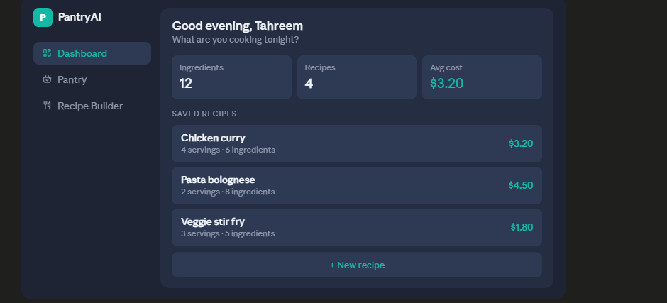
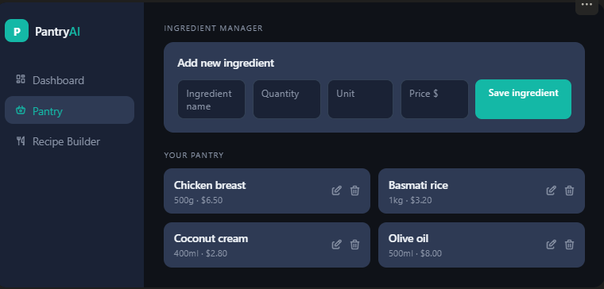
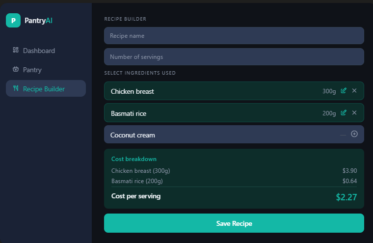

# PantryAI 🍳

> **Smart recipe costing** — manage your pantry ingredients and calculate the exact cost of every recipe you cook.

---

## Features

- **Dashboard** — overview of your ingredients, recipes, and average cost per serving
- **Pantry Manager** — add, edit, and delete ingredients with quantity, unit, and price
- **Recipe Builder** — select ingredients, set quantities used, and get an instant cost breakdown
- **Cost Breakdown** — see exactly how much each ingredient contributes to a recipe
- **Responsive** — works on desktop and mobile

---

## Tech Stack

- **Frontend** — React + TypeScript
- **Styling** — Tailwind CSS v3
- **Bundler** — Vite
- **State** — React useState (lifted to App.tsx)
- **Database** — Supabase (coming soon)
- **Auth** — Supabase Auth (coming soon)

---

## Screenshots

### Dashboard



### Pantry Manager



### Recipe Builder



---

## Getting Started

### Prerequisites

- Node.js v20+
- npm v10+

### Installation

```bash
# Clone the repo
git clone https://github.com/syedatahreem/Pantry-AI

# Navigate to the project
cd recipe-cost-calculator

# Install dependencies
npm install

# Start the dev server
npm run dev
```

Open [http://localhost:5173](http://localhost:5173) in your browser.

---

## Project Structure

```
src/
├── components/
│   ├── layout/
│   │   ├── Layout.tsx
│   │   └── Sidebar.tsx
│   ├── Dashboard/
│   │   └── Dashboard.tsx
│   ├── Pantry/
│   │   └── Pantry.tsx
│   └── RecipeBuilder/
│       └── RecipeBuilder.tsx
├── types/
│   └── index.ts
└── App.tsx
```

---

## Roadmap

- [x] Pantry ingredient management
- [x] Recipe cost calculator
- [x] Real-time cost breakdown
- [ ] Supabase database integration
- [ ] User authentication
- [ ] Edit and delete recipes
- [ ] Mobile responsive layout
- [ ] AI-generated recipes (Gemini API)

---
